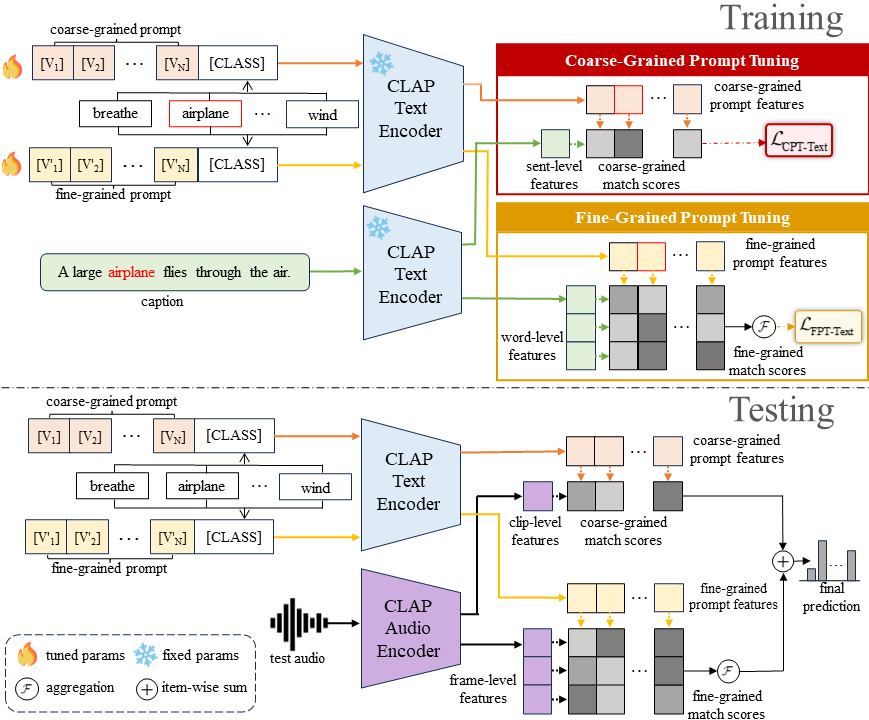

# Audio-Free-P-Tuning
The official implementations of "Audio-Free Prompt Tuning for Language-Audio Models" (accepted by ICASSP 2024). 

[](https://opensource.org/licenses/MIT)


## Introduction

We propose an efficient audio-free prompt tuning scheme aimed at optimizing a few prompt tokens from texts instead of audios, which regularizes the model space to avoid overfitting the seen classes as well. 

Here is an overview of it,




## Get started

We provide the source code to employ our method on MS-CLAP ([microsoft/CLAP: Learning audio concepts from natural language supervision (github.com)](https://github.com/microsoft/CLAP)). Here are the instructions to run it,

1. Download the related datasets including esc-50, urbansound8k, fsd2019 as well as dcase2019.
2. Download the pretrained weights of MS-CLAP which can be found in [microsoft/msclap at main (huggingface.co)](https://huggingface.co/microsoft/msclap/tree/main).
3. Build up the environment. The environment of this code is the same as the MS-CLAP.
4. Clone the codes by:

```
git clone https://github.com/Ming-er/Audio-Free-P-Tuning.git
```
5. Change all required paths (model_path and dataset_path) in `src/configs/config.yml`  to your own paths. 

6. If you want to train on single-label datasets, including  esc-50 and urbansound8k, modify the 'dataset'  in `src/configs/config.yml`  to corresponding names, and run
```
python zs_enhance_text.py
```
7. If you want to train on multi-label datasets, including  fsd2019 and dcase2019, modify the 'dataset'  in `src/configs/config.yml`  to corresponding names, and run
```
python zs_enhance_text_ml.py
```


## Citation

If you want to cite this paper:

```
@article{li2023audio,
  title={Audio-free Prompt Tuning for Language-Audio Models},
  author={Li, Yiming and Wang, Xiangdong and Liu, Hong},
  journal={arXiv preprint arXiv:2309.08357},
  year={2023}
}
```
